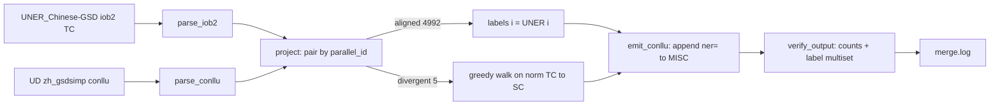

# Repository Guidelines

## Project Overview
`UD_Chinese-GSDSimp` is the **Simplified-Chinese Universal Dependencies treebank** — a linguistic *dataset*, not application software. It ships three CoNLL-U files (train/dev/test) converted from the traditional GSD treebank via OpenCC plus manual fixes. This session added a **Named Entity Recognition layer**: IOB2 NER labels (`ner=` in the MISC column) projected from [UNER_Chinese-GSD](https://github.com/UniversalNER/UNER_Chinese-GSD) (part of [Universal NER](https://www.universalner.org/), based on UD_Chinese-GSD). Coverage: 4997 sentences (3997/500/500), 123289 tokens. License: CC BY-SA 4.0 (treebank and NER labels); cite Mayhew et al., *Universal NER*, NAACL 2024.

## Architecture & Data Flow
The repository *is* the data product. The only executable code is `merge_ner.py`, a batch pipeline that regenerates the NER layer from the UNER source.



Key modules (all in `merge_ner.py`): `parse_iob2`, `parse_conllu`, `learn_tc_sc_map`, `project`, `emit_conllu`, `verify_output`, `write_merge_log`, `main`.
- **Pairing**: by sentence index — `UD # parallel_id == zhgsd/{split}{N}`; UNER/UD counts match 3997/500/500.
- **Aligned sentences (4992)**: label transfers position-by-position, guarded by per-position form-length equality.
- **Divergent sentences (5)**: deterministic greedy walk over normalized (Traditional→Simplified) forms; a merge takes the *first* constituent's label, a split gives the first sub-token the label and the rest `O`. Any unmatchable pair or leftover tail is a hard error — never a silent mislabel.
- **Atomic writes**: temp file + `os.replace`. Only column 10 (MISC) is touched; columns 1–9 stay byte-identical.

## Key Directories
Flat layout — no `src/` tree. All artifacts live at repo root.
- `zh_gsdsimp-ud-{train,dev,test}.conllu` — the data product (now with `ner=`).
- `merge_ner.py`, `merge.log` — NER pipeline + divergence audit trail.
- `README.md`, `CONTRIBUTING.md`, `LICENSE.txt`, `stats.xml`, `eval.log` — docs/metadata.
- **External sibling (read-only source, NOT in this repo)**: `/home/zh/workspace/UNER_Chinese-GSD` — UNER IOB2 inputs. `merge_ner.py` locates it by walking up to 6 ancestors for a `UNER_Chinese-GSD` directory. Do not modify it.

## Development Commands
No build, lint, or test runner — this is a dataset. The one executable command regenerates/verifies the NER layer:

```bash
# from repo root; requires the sibling UNER_Chinese-GSD directory
python3 merge_ner.py
# -> exit 0, prints 3997/500/500 sentences, 98614/12665/12010 tokens, divergent 2/1/2
```

Verify a merge result (after `merge_ner.py`):
```bash
grep -c -F '|ner=' zh_gsdsimp-ud-{train,dev,test}.conllu   # 98614 / 12665 / 12010
grep -c '^# sent_id'  zh_gsdsimp-ud-{train,dev,test}.conllu # 3997 / 500 / 500
git -C /home/zh/workspace/UNER_Chinese-GSD status --short   # must be empty (source untouched)
git diff   # token lines change ONLY by appending |ner=… to col 10; cols 1–9 identical
```

## Code Conventions & Common Patterns
`merge_ner.py` is **Python 3 stdlib-only** (no pip/network). When editing it:
- **Fail fast / hard**: unexpected data → `die(msg)` (prints `ERROR:` to stderr, `sys.exit(1)`). No swallowed exceptions, no bare `except`. Misalignment or running on already-merged files aborts the run.
- **Re-run guard**: `parse_conllu` dies if any MISC already contains `ner=` — never re-run on merged output.
- **Oracle-based self-verification**: `EXPECTED_TOKENS` and `EXPECTED_LABELS` multisets are asserted in `verify_output`; change them only with a documented reason.
- **Reserved extension point = MISC**: CoNLL-U is strictly 10 columns; add attributes as `key=value` pairs in MISC, never an 11th column (UD validators reject it).
- **IOB2 label set**: `O, B/I-PER, B/I-LOC, B/I-ORG` (see `VALID_LABELS`).
- No async, no dependency injection, no persistent state — it is a single-pass batch script. Keep it that way.

## Important Files
| File | Role |
|------|------|
| `zh_gsdsimp-ud-{train,dev,test}.conllu` | Primary deliverable; CoNLL-U with `ner=` in MISC |
| `merge_ner.py` | Only code; NER projection + verification entry point (`main()`) |
| `merge.log` | 5 divergence blocks (sentence id, UNER/UD text, merge/split events) |
| `README.md` | NER-layer docs, source attribution, CC BY-SA 4.0 license, citation |
| `stats.xml` | Authoritative counts (4997 sents / 123289 tokens) — matches script oracles |
| `eval.log` | Snapshot of upstream UD `validate.py` run (pre-NER baseline) |
| `LICENSE.txt` | CC BY-SA 4.0 |
| `/home/zh/workspace/UNER_Chinese-GSD` | Read-only NER source (external sibling) |

## Runtime / Tooling Preferences
- **Python 3, stdlib only** — run with `python3`. No `package.json`, `pyproject.toml`, virtualenv, or package manager. Do not add third-party dependencies.
- No Node/Bun/Go toolchain involved.
- Historical conversion used **OpenCC** (external, not pinned here). Official UD validation uses external `validate.py` (UD tools repo), not committed.
- **Git**: follow the worktree workflow for non-trivial changes (create `worktrees/branch-<name>`, merge back via fast-forward). Per `CONTRIBUTING.md`, **do not open PRs against `master`** — follow the Universal Dependencies contributing policy.

## Testing & QA
No conventional unit/integration tests (expected for a treebank). Quality is enforced two ways:
1. **Built-in self-verification** in `merge_ner.py` (runs on every invocation, exits non-zero on failure): 10-column invariant, re-run guard, per-split sentence/token counts, **label multiset equality** against `EXPECTED_LABELS`, exactly one valid `ner=` per token, columns 1–9 unchanged.
2. **External UD validation** (not in repo): `validate.py --lang zh` from the UD tools checks CoNLL-U structure + UPOS/feat/deprel validity. Because `ner=` is a new MISC key (not a new column), 10-column validity is preserved.

AI-assistant verification checklist after any edit to the `.conllu`/script:
- `python3 merge_ner.py` exits 0 and prints the expected counts.
- `grep -c -F '|ner='` equals 98614/12665/12010; `grep -c '^# sent_id'` equals 3997/500/500.
- `git diff` shows token lines changed only in column 10.
